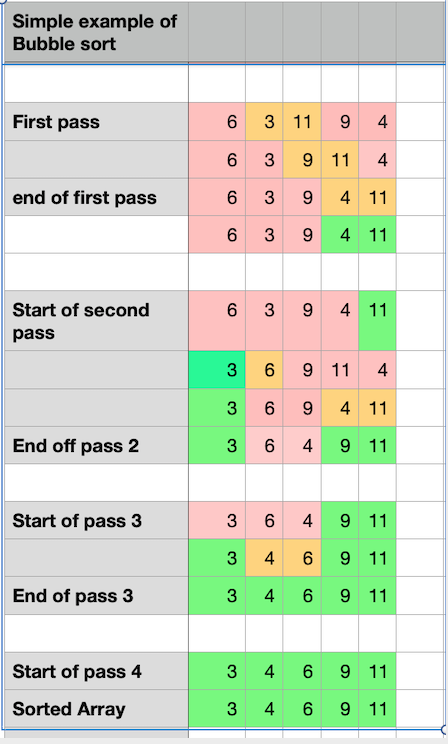
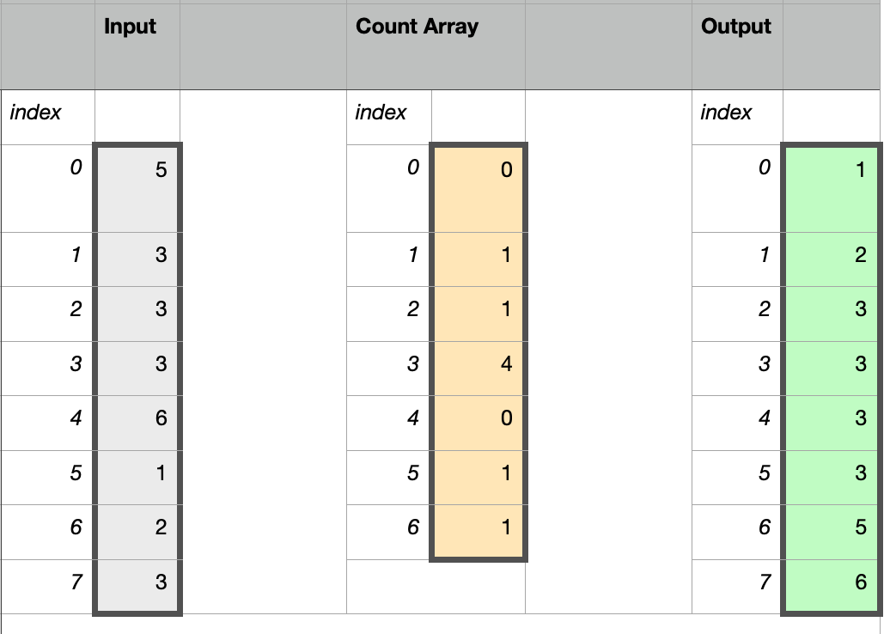
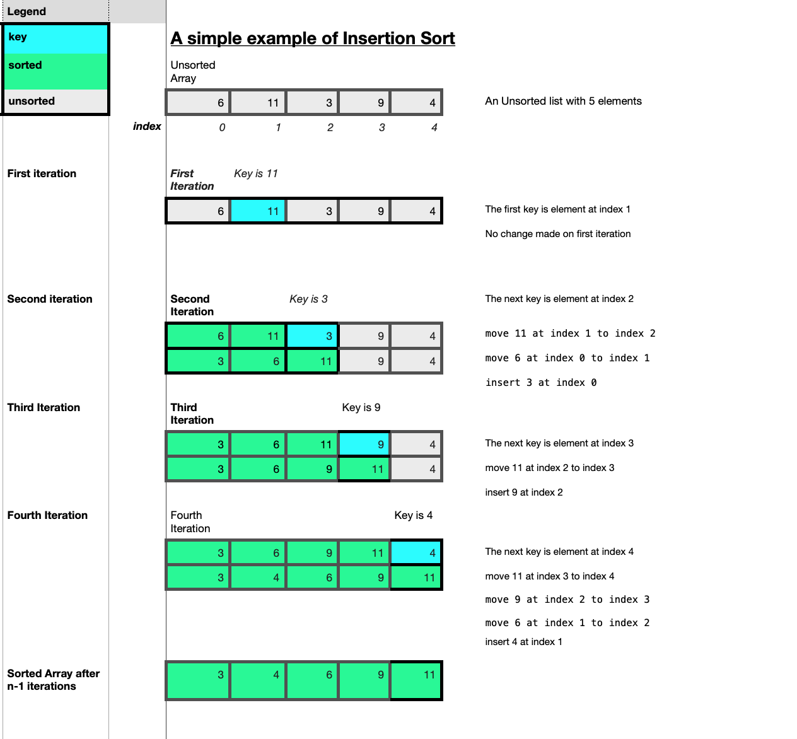

# Project: Benchmarking Sorting Algorithms in Python

## Table of Contents

- [1. Introduction](#1.-introduction)
- [2.  Five Sorting Algorithms ](#2-five-sorting-algorithms)
- [2.1.1 Bubble Sort: A Simple comparison-based sort](#2.1.1-bubble-sort:-a-simple-comparison-based-sort )
- [2.1.2 Merge Sort:  An efficient comparison based sort](#2.1.2-merge-sort:-an-efficient-comparison-based-sort)
- [2.1.3 Counting Sort:  A non comparison sort](#2.1.3-counting-sort:-a-non-comparison-sort)
- [2.1.4 Insertion Sort any other sorting algorithm of your choice](#2.1.4-insertion-sort-any-other-sorting algorithm-of-your-choice)
- [2.1.5 Quick Sort]
- [3 Implementation and Benchmarking](#3-implementation-and-benchmarking)
- [References](#references)

## 1. Introduction 
(introduction 10%): 
**Introduce the concept of sorting and sorting algorithms, discuss the relevance of concepts such as complexity (time and space), performance, in-place sorting, stable sorting, comparator functions, comparison-based and non-comparison-based sorts, etc.**

Notes based largely on information from Algorithms in a Nutshell and lecture notes. Any other source is referenced as it arises.
Review and edit.

**Sorting** is the process or operation of ordering items and data according to specific criteria [Collins Dictionary](https://www.collinsdictionary.com/dictionary/english/sorting). Arranging items, whether manually or digitally into some order makes many common tasks easier to do. Sorted information is nearly always easier for human beings to understand and work with, whether it is looking up a number in a phone book, finding a book on a library or bookshop shelf, referring to a statistical tables book, deciding what to watch on television. It is even more pervasive when we use technology. Social media and news feeds, emails, search items in a browser or recommendations for where to eat to what to do are all sorted according to some algorithms whether it is by date, popularity, location etc.

Sorted sequences are commonly used to make many other tasks more efficient as many computations can be simplified by having the information properly sorted beforehand. 
Sorting is a common operation in many computer applications and the search for efficient sorting algorithms dominated the early days of computing. Numerous computations and tasks are simplified by properly sorting information in advance, searching for a particular item in a list, checking if there are duplicate items in a list or collection, determining the smallest and largest values or the most common values or least common values can all be more easily done when the data is already sorted. 

According to [Algorithms to live by](), sorting is at the very heart of what computers do and is what actually brought computers into being in the first place. The task of tabulating the US Census in the late nineteenth century became very difficult as the population grew. An inventor Herman Hollerith was inspired by the punched railway tickets of the time to devise a system of punched cards and a machine (the Hollerith Machine) to count and sort them. This system was then used for the 1890 census. Hollerith's company later merged with others in 1911 to become the Computing Tabulating Recording Company which was later renamed to International Business Machines (IBM). 
Sorting then lay behind the development of the computer in the 20th century. By the 1960's it was estimated by one study that more than a quarter of the world's computing resouces were spent on sorting.

According to Algorithms in a Nutshell, if a collection of comparable elements `A` is presented to be sorted in place where `A[i]` and `ai` refer to the ith element in the collection with `A[0]` being the first element in the collection, then to sort the collection the elements `A` must be reorganised so that if `A[i] < A[j]`, then `i < j`. Any duplicate elements must be contiguous in the resulting ordered collection. This means that if `A[i] = A[j]` in a sorted collection, then there can be no `k` such that `i < k < j` and `A[i] ≠ A[k]`. Finally, the sorted collection A must be a permutation of the elements that originally formed `A`. 

The book also outlines how "the elements in the collection being compared must admit a total ordering. That is, for any two elements p and q in a collection, exactly one of the following three predicates is true: `p = q`, `p < q`, or `p > q` ".

Numbers and single characters can be quite easily sorted. While composite elements such as strings of characters are usually sorted by sorting each individual element of the string. Two elements can be compared to each other to see if they are less than, greater than or equal to each other.  Sorting of custom objects may require a custom ordering scheme. In general a **comparator function** compares the elements p to q and returns 0 if p = q, a negative number if p < q, and a positive number if p > q. Using the example provided in the book, an airport terminal might list outbound flights in ascending order of destination city or departure time while flight numbers appear to be unordered.

The concept of sorting and sorting algorithms, the relevance of concepts such as **complexity** (time and space), **performance**, **in-place sorting**, **stable sorting**, **comparator functions**, **comparison-based** and **non-comparison-based** sorts, etc.

An **algorithm** is a set of rules to obtain the expected output from the given input. A computer programming task can be broken down into two main steps - writing the algorithm as an ordered sequence of steps that can be used to solve the problem and then implementing the sequenced of steps in a programming language such as Python so that the machine can run the algorithm. While humans can usually follow algorithms that are not very precise in order to accomplish a task, this is not the case for computers and therefore the algorithms have to be written very precisely.

There are many different ways that algorithms could be designed to achieve a similar goal. Therefore there needs to be some way of deciding which algorithm is preferable for a particular use case and therefore some way of comparing the alternative algorithms is required. A well-designed algorithm should produce the **correct solution** for a given input using computational resources **efficiently**. It should have well defined inputs and outputs and the algorithm should end after a finite number of steps. Every step of the algorithm should be precisely defined so there is no ambiguity as a computer can only do what it is instructed to do.
The algorithm should always produce a correct solution, or at least one that is within an acceptable margin of error. The algorithm should be feasible giving the computational resources such as processing power, memory, storage etc. 

While there are other factors (including memory usage, storage usage, network usage, number of read-write operations) to be considered when evaluating the efficiency of an algorithm, the main focus in this project is the time **efficiency** - how the time taken varies with the size of the input. The algorithm should complete its task in an acceptable amount of time

The properties of an algorithm include speed, efficiency, readability, complexity and computability. 

Algorithms vary in their space and time efficiency, even those that have the same purpose such as sorting algorithms. 
While space efficiency looks at the amount of memory or storage needed to run a program/algorithm, time efficiency looks at the effect of the input data on the run time or number of operations needed to run an algorithm.
An algorithms efficiency can be analysed in two different ways. **A priori** analysis (before) looks at the efficiency of an algorithm from a theoretical perspective without being concerned with the actual implementation on any particular machine.
The relative efficiency of algorithms is analysed by comparing their **order of growth** with respect to the size of the input N and is a measure of the **complexity** of an algorithm, looking at the growth requirements as the input size increases. (The order of growth refers to how the size of the resource requirements increase as a function of the input size n.  As input size increases so too does the number of operations required and the work required).
Complexity measures an algorithm’s efficiency with respect to internal factors, such as the time needed to run an algorithm and is a feature of the steps in the algorithms rather than the actual implementation of the algorithm. 

A **posteriori** analysis, on the other hand, is a measure of the **performance** of an algorithm and evaluates efficiency **empirically**, comparing algorithms implemented on the same target platform to get their relative efficiency.
Performance depends on the actual computer resources such as time, memory, disk, speed, compiler etc required to run a specific algorithm. Performance does not affect complexity but complexity can affect performace as the algorithm's design will feed into how the code is written and implemented. (This project involves measuring the actual performance of sorting algorithms and therefore depends on the specifics of the machine used.)

**In-place** sorting 
According to [wikipedia](https://en.wikipedia.org/wiki/In-place_algorithm), *in computer science, an in-place algorithm is an algorithm which transforms input using no auxiliary data structure. However a small amount of extra storage space is allowed for auxiliary variables. The input is usually overwritten by the output as the algorithm executes. In-place algorithm updates input sequence only through replacement or swapping of elements. An algorithm which is not in-place is sometimes called not-in-place or out-of-place.*

The various sorting algorithms differ from each other in their memory requirements which depends on how the actual algorithm works. When a sorting algorithm is run, it has to first read the input data from a storage location to the computers RAM. An **in-place** sorting algorithm is one that only uses a fixed additional amount of working space, no matter what the input size whereas other sorting algorithms may require additional working memory  which is often related to the input size. If there is limited memory available then in-place sorting is desirable.
By producing the sorted output in the same memory space as the input data to be sorted avoids the need to use double the space. A sorting algorithm will still need some extra storage for working variables though.

Some algorithm create empty arrays to hold sorted copies and this requires more memory as the size of the input increases. (mention which ones). In-place sorting does not require additional arrays as the relative position of the elements are swapped within the array to be sorted and therefore additional memory should not be required.

**Stability** means that equivalent elements will retain their relative positioning after the sorting has taken place.
With a stable sorting algorithm the order of equal elements is the same in the input and output.
 It is an important factor to consider when sorting key value pairs where the data might contain duplicate keys. This project only looks at sorting one dimensional arrays of integers but there are many other applications of sorting where the data has more than one dimension, in which case the data is sorted based on one column of data known as the key with the rest of the data is known as satellite data and should travel with the key when it is moved to another position.
According to [Reference: Pollice G., Selkow S. and Heineman G. (2016). Algorithms in a Nutshell, 2nd Edition. O' Reilly.], if two elements (ai and aj) in the original unsorted data are equal (as determined by the comparator function), stable sorting refers to the fact such pairs of equal elements will retain their relative ordering after the sorting has taken place. If i < j then the final location of a<sub>i</sub> must be to the left of a<sub>j</sub>. Sorting algorithms that can guarantee this property are considered stable. 

A sorting algorithm is considered stable if two objects with equal keys end up in the same order in the sorted output as they appear in the input. An unstable algorithm does not pay attention to the relationship between element locations in the original collection and does not guarantee the relative ordered will be kept after the sorting has taken place.
See [geeksforgeeks](https://www.geeksforgeeks.org/stability-in-sorting-algorithms/)

A sorting algorithm is considered **comparison-based** if the only way to gain information about the total order is by comparing a pair of elements at a time using comparator operators to see which of the two elements should appear first in the sorted list. Comparison sorts do not make any assumptions about the data and compare all the elements against each other.
Simple sorting algorithms such as Bubble Sort, Insertion Sort, and Selection Sort are comparison-based sorts.  On the other hand, there are other sorting algorithms such as Counting Sort, Bucket Sort and Radix Sort which do make some assumptions about the data. These type type of algorithms consider the distribution of the data and the range of values that the data falls into and in doing so avoiding  the need to compare all elements to each other.
 
The speed of an algorithm to complete is one of the most important factors for choosing an algorithm. The speed will highly depend on the platform it is run on and therefore cannot really compare algorithms that are run on different machines with different capabilities or come to conclusions about the algorithm in general. While you could use a limited form of empirical comparison on your own machine, the results could not be applied generally. Instead the concept of complexity can be analysed mathematically. The actual time an algorithm takes to run doesn't tell the full story as it can be influenced by other factors such as the the available memory or the speed of the processor. 

Complexity allows for algorithms to be compared by looking at their running time as a function of the input data size and in this way see which algorithms scale well to solve problems of a nontrivial size. Algorithmic complexity typically falls into one of a number of growth families (i.e. the growth in its execution time with respect to increasing input size n is of a certain order). Complexity looks at how the resource requirements grow as the input size increases, how the time required increases as the number of inputs increase.
Memory or storage requirements of an algorithm could also be evaluated in this manner.

The runtime of sorting algorithms can be measured by measuring the actual implementation of the algorithm using a timer function like pythons `timeit` module. The theoretical runtime complexity can be measured uses `Big O` notation which is a measure of the expected efficiency of an algorithm and measures the asymptotic behaviours of functions which means it measures how quickly a function grows or declines. The growth rate of a function is also called its *order*.  
Big  represents the relationship between the size of the input  and the number of operations the algorithm takes and shows how quickly the the runtime grows as the input size increases. 

Big  notation is usually used to describe the complexity of an algorithm in the worst-case scenario. It could also be used to describe the execution time required or the memory space used by an algorithm. 
While for small input size n all algorithms are efficient, when the size becomes non-trivial then 
the order or growth or Big  notation of an algorithm will become more and more significant and become more and more important.

If two algorithms have the same Big  notation, that does not mean they will execute in exactly the same times, but that the order of the number of operations that they will require to complete will be the same. 

The details of the project will look at the runtime complexity of 5 different sorting algorithms.


Constant, linear, quadratic, exponential and logarithmic... 

***

## 2.  Five Sorting Algorithms 
(5 x 5 = 25%): 
Introduce each of your chosen algorithms in turn, discuss their **space and time complexity**, and **explain how each algorithm works** using your own diagrams and different example input instances.

(by different example input instances, he means that each algorithm has its own average, best and worst case. The example inputs to be used in the report should highlight the behaviour of the algorithms under these different conditions.??)

***

## 2.1.1 Bubble Sort: A Simple Comparison based sort 
See [wikipedia](https://en.wikipedia.org/wiki/Bubble_sort), [programiz](https://www.programiz.com/dsa/bubble-sort), [W3resources](https://www.w3resource.com/python-exercises/data-structures-and-algorithms/python-search-and-sorting-exercise-4.php), [geekforgeeks](https://www.geeksforgeeks.org/bubble-sort/), [runestone interactive python](https://runestone.academy/runestone/books/published/pythonds/SortSearch/TheBubbleSort.html)

Bubble Sort is a fairly simple comparison-based sorting algorithm and is so named for the way larger values in a list “bubble up” to the end as sorting takes place. The algorithm repeatedly goes through the list to be sorted, comparing and swapping adjacent elements that are out of order.  With every new pass through the data, the next largest element bubbles up towards it's correct position. Although it is quite simple to understand and to implement, it is slow and impractical for most problems apart from situations where the data is already nearly sorted.

**Explaining how the algorithm works:**

Bubble Sort works by repeatedly comparing neighbouring elements and swapping them if they are out of order. It makes multiple passes or iterations through the list and with each pass through the list, the next largest element in it's proper place.
It starts by comparing each element in the list (except the very last one) with it's neighbour to the right, swapping the elements which are out of order. At the end of the first pass, the last and largest element is now in it's final place.
The second pass compares each element (except the last two) with the neighbour to the right, again swapping the elements which are out of order. At the end of the second pass through the data, the largest two elements are now in their final place. 


The algorithm continues by comparing and swapping the remaining elements in the list in the same way, except those now already sorted at the end of the list. With each iteration the sorted side on the right gets bigger and the unsorted side on the left gets smaller, until there are no more unsorted elements on the left. 

## Example
Here I will illustrate how the algorithm works using a small input array.
Need to get the image showing up here..


- The array to be sorted [6, 11, 3, 9, 4]
- The number of passes or iterations required will be n-1 = 4 on a list of size 5.

For the first pass, the algorithm iterates through the array from left to right, the first pair of elements that are out of order is `(11,3)` so the order of this pair is swapped and the array becomes `[6, 3, 11, 9, 4]`. Then the elements `11` and `9` are compared and swapped resulting in `[6	3 9	 11	4]` then `11` and `4` are swapped. At the start of the second pass, the array is now `[6	3	9	11	4]`. The first pair of elements to be swapped is `(6,3)`


- In the first pass, swaps are made between the following pairs of elements:  `(11, 3)`, then for `(11, 9)` then `(11, 4)`.
- At the end of the first pass the array is now `[6, 3, 9, 4, 11]`.
- At the end of the first pass, the largest element `11` is now in its correct position.
- The first swap in the second pass is `(6, 3)`, then `(9, 4)` resulting in `[3, 6, 4, 9, 11]` at the end of the second pass.
- The second largest element `9` is now in it's correct place.
- On the 3rd pass through the list, there is only one pair to be swapped `(6,4)`.
- At the end of the array is sorted `[3, 4, 6, 9, 11]` with each element in its correct sorted order.
- Nevertheless the algorithm still does a 4th pass through the array, although there are no more elements to be sorted.
- The algorithm is finished.

The example here shows how n-1 passes are made through the array of n elements. 
there are n-1 comparisons performed on the first pass, n-2 on the second pass, n-3 on the third pass and n-4 on the 4th pass.

The total number of comparisons is the sum of the first n-1 integers. 





Illustrating the **worst-case** scenario where the array is in reverse order:
` [5, 4, 3, 2, 1]`

- In the first pass, 4 swaps are made, `(5,4)`,'(5,3)`,`(5,2)` and `(5,1)`
- In the second pass 3 swaps are made `(4,3)`, `(4,2)` and `(4,1)`
- In the third pass, the 2 swaps are made, `(3,2)` and `(3,1)`
- In the final pass, 1 swap is made, `(2,1)`.
- In this case where all the elements were in reverse order, it tooks 10 swaps to sort the 5 element array.

There are n -1 passes through a list of n items. The total number of comparisons is the sum if the first `n-1` integers which is `1/2 n squared - 1/2 n` .
Need to **format the fractions!!** for markdown. 
This results in O(n<sup>2</sup>) comparisons.

- An array that is almost sorted still requires n-1 passes through the data, unless the optimised version of the algorithm is used.
- In the best case where the array is already sorted, no exchanges are made but the comparisons still have to happen.

The average case for the Bubble Sort algorithm is that exchnages are made half the time.    

The python code to implement the Bubble Sort algorithm above is as follows. This code is widely available online and while there are some small differences, they are all largely the same. The code used in this project was adapted from code at [runestone academy](https://runestone.academy/runestone/books/published/pythonds/SortSearch/TheBubbleSort.html). There is also an optimised version of the bubble sort algorithm known as the `Short bubble` which stops early if the algorithm finds that the list has become sorted already before all the loops have executed.


A nested loop is used to compare each element and sort them into the correct place.
The outer loop `for passnum in range(len(alist)-1,0,-1)` starts from the second last element in the list and gets shorter each time, taking account of the fact that the elements at the end of the list are becoming sorted with each iteration of the outside loop. The inner loop goes through the elements, comparing the element on the left with the element on the right 


The `temp` variable can be replaced in the `Python` programming language by using simultaneous assignments `if array[i] > array[i+1] : array[i], array[i+1] = array[i+1], array[i]`


```python
def bubbleSort(array):
    # The outer loop goes through the elements n-1 times, if n is the number of elements in the list

    for passnum in range(len(array)-1,0,-1):
        # count down to 0 as each time another element at the end of the list is sorted.
        # at each pass the last i elements are already in place so the inner loop is shorted by 1 each time
        for i in range(passnum): 
            # comparing each element i with the element right beside it (i+1)  
            if array[i] > array[i+1] : 
                # If the elements are out of order swap them so the largest element is right of the smaller one
                array[i], array[i+1] = array[i+1], array[i]
```
There are  passes required where n is the number of elements in the array minus 1.
The outer loop runs  times. At the end of each iteration, another element will be in it's final sorted position. The inner loop goes through each element in the array up to the element(s) already sorted, each time comparing each element `i` with the element to the immediate right of it `i+1`.
Using the `>` comparison operator, the elements are compared. If the element on the left (at index `i`) is greater in value than the element on it's right (at index `i`) then the elements are swapped.


### Analysing Bubble Sort.
**Time and Space complexity of bubble sort**

See [realpython] and lecture notes.
The algorithm here has two `for` loops where it first performs $n-1$ comparisons, then $n-2$ comparisons and so on down to the final comparison. 


In the **worst** case the outer loop has to execute  times and in the **average** case the inner loop executes about  times for each outer loop.
Inside the inner loop, the comparison and swap operations take constant time k.

So it total it performs %20%2B%20(n-2)%20%2B%20(n-3)%20...%20%2B%202%2B1) which is  %20)

(removing the constants which don't change with input size simplifies it to , the n is them removed as  grows faster.

The worst case scenario for Bubble sort occurs when the data to be sorted is in reverse order.

The bubble sort algorithm here always runs in ) times even if the array is sorted. The algorithm can be optimised to stop the algorithm if the inner loop didn't cause any swaps. 
If the optimised version of the bubble sort algorithm is applied on a nearly sorted array then the best case will be ). This optimised version of the algorithm was not used here. 

The average case is when the elements of the array are in random order.

The space complexity of Bubble Sort algorithm is ). The only additional memory is needed for the temporary  variable used for the swapping.

Note here does using simultaneous assignment instead of temporary variables in Python change this?????????

Bubble sort is an **in-place** sorting algorithm and it is **stable**. It is not a very practical algorithm to use is considered very inefficient sorting method as many exchanges are made before their final locations are known. One advantage of using the bubble sort over other sorting algorithms is that it is possible to determine that the list is already sorted if there are no exchanges made during the pass. The regular bubble sort algorithm needs to be modified to do this though.
See [runestone](https://runestone.academy/runestone/books/published/pythonds/SortSearch/TheBubbleSort.html)

## Summary of time and space complexity of Bubble Sort:

- Best Case complexity: )
- Average Case complexity: )
- Worst Case complexity: )
- Space complexity:  )

The results from the benchmarking will be in section 3 - Implementation and Benchmarking.

***
## 2.1.2 Merge Sort:  An efficient comparison based sort

- See [merge sort](https://runestone.academy/runestone/books/published/pythonds/SortSearch/TheMergeSort.html), [programiz](https://www.programiz.com/dsa/merge-sort)

[Merge Sort](https://en.wikipedia.org/wiki/Merge_sort) is an efficient, general-purpose, comparison-based sorting algorithm. Merge sort is a divide-and-conquer algorithm that was proposed by John von Neumann in 1945. It uses recursion to continually split the list in half. 
A sub-list of 0 or 1 items is considered sorted. Once the two halves are sorted a **merge** operation is performed which combines the two smaller sub-lists into a single sorted new sublist.

A [divide-and-conquer](https://en.wikipedia.org/wiki/Divide-and-conquer_algorithm) algorithm recursively breaks a problem down into two or more sub-problems of the same or related type until these become simple enough to be solved directly. Then the solutions to the sub-problems are combined to produce a solution to the original problem.


#### Explain how Merge Sort works using own diagrams and different example input instances...

The algorithm uses divide-and-conquer approach by breaking down the list into two evenly (as much as possible) sized halves, then repeatedly does this to each half until the sublist contains a single element or less. Each sub problem is then sorted recursively and the solutions to all the sub-lists are combined into a single sorted new list.

A list with one or less elements is considered sorted and is the base case for the recursion to stop. If the list has more than one item then it is split in half and the algorithm is recursively called on each half. When both halves are sorted, the smaller lists are then merged or combined into a single sorted list.
All the smaller-sublists are repeatedly merged back into a new single sorted list.
This algorithm will need extra memory to copy the elements when sorting. The extra space is needed to store the two halves when they are extracted using the slicing.

**need to insert image of merge sort example here ...**


## The python code for Merge Sort

The following is the python code for the Merge Sort algorithm. This code is widely available online. 
The code used in this project is based on the code at [runestone academy](https://runestone.academy/runestone/books/published/pythonds/SortSearch/TheMergeSort.html). I have added comments to the code in the accompanying python script which is used in this benchmarking project. See `merge.py`.


```python
def merge_sort(array):
    # the base case is a list with 0 or 1 elements which is is already sorted.

    if len(array)>1:
        # find the middle of the list using integer division to find the split point
        mid = len(array)//2
        # divide the elements into two halves using the mid point
        # # The elements are copied into the temporary arrays left[] and right[]
        # left contains the elements from the first half of the list (up to the mid)
        left = array[:mid]
        # right contains the elements from the second half of the list, (from mid to the end)
        right = array[mid:]
        # recursively call the function on the first (left) half
        merge_sort(left)
        # recursively call the function on the second (right) half
        merge_sort(right)

        # once the function has been called on the left and right half, each half should be sorted
        # The following code does the merge part, merging the two smaller lists into a single sorted list 
        # i, j and k represents the index of the left array, right array and merged arrays respectively.
        i ,j, k = 0,0,0
        # The elements are placed back into the original list (array) by repeatedly taking the smallest item from the two sorted lists.

        # until the left and right arrays are empty.
        while i < len(left) and j < len(right):
            # compare the first/next element in left and right arrays, if the left element is smaller, place this element next in the sorted array
            if left[i] <= right[j]:
                array[k]=left[i]
                # increment the index of left (for the next comparison between left and right arrays)
                i += 1
            else:
                # otherwise if the smallest element is in the right array, assign this element to the next position in the merged array
                array[k]=right[j]
                # increment the index of the right array (for the next comparison between left and right arrays)
                j += 1
            # after assigning another element to the merged array, increment the index by 1
            k=k+1
        # no elements left in right array so check if any element left in the left array, if so move to merged array
        while i < len(left):
            array[k]=left[i]
            i += 1
            k += 1
        # no elements left in left array, so check if any elements left in the right array, if so move to merged array
        while j < len(right):
            array[k]=right[j]
            j += 1
            k += 1
    return array

```
The Merge Sort algorithm uses a recursive divide-and-conquer approach which results in a worst-case running time of ).

The algorithm consists of two distinct processes, the splitting and the merging. 
- A list can be split in half  times where n is the number of elements in the list.
- Each item in the list will eventually be processed and placed in the sorted list. This means a list of size n will require n operations.
Therefore there are  splits, each of which costs n for a total of  operations
- Merge Sort needs extra space to hold the left and right halves which can be a critical factor for large datasets.
See [interactive python](https://runestone.academy/runestone/books/published/pythonds/SortSearch/TheMergeSort.html)


Merge-Sort gives good all around performances with similar best, worst and average cases with a linearitmic ) time complexity in each case. This makes it a good choice if predictable run-time is important.
There are versions of Merge Sort which are particularly good for sorting data with slow access times such as data that cannot be held in RAM or are stored in linked lists. 
Merge Sort is a stable sorting algorithm.

## Summary of time and space complexity of Merge Sort

- Best Case complexity: )
- Average Case complexity: )
- Worst Case complexity: )
- Space complexity:  )


***
## 2.1.3 Counting Sort:  A non comparison sort


See [w3resources](https://www.w3resource.com/python-exercises/data-structures-and-algorithms/python-search-and-sorting-exercise-10.php),[wikipedia](https://en.wikipedia.org/wiki/Counting_sort), [programiz](https://www.programiz.com/dsa/counting-sort), [geeksforgeeks](https://www.geeksforgeeks.org/counting-sort/).


The Counting Sort algorithm was proposed by Harold H. Seward in 1954.
[Counting sort](https://en.wikipedia.org/wiki/Counting_sort) is an algorithm for sorting a collection of objects according to keys that are small integers; that is, it is an integer sorting algorithm. It operates by counting the number of objects that have each distinct key value, and using arithmetic on those counts to determine the positions of each key value in the output sequence.

While comparison sorts such as Merge Sort make no assumptions about the data, comparing all elements against each other, non-comparison sorts such as Counting Sort do make assumptions about the data, such as the range of values the data falls into and the distribution of the data. In this way the need to compare all elements against each other is avoided. Counting Sort allows for a collection of items to be sorted in close to linear time which is made possible by making assumptions about the type of data to be sorted.

The Counting Sort algorithm is a sorting technique based on `keys` between a specific range and works by counting the number of objects having distinct key values. To implement it you need to determine the maximum value in the range of values to be sorted. This is then used to define the `keys`. The keys are all the possible values that the data to be sorted can take. An auxillary `count` array is created to store the count of the number of times each key value occurs in the input data. Go through the array of input data and record how many times each distinct key value occurs. The sorted data in then built based on the frequencues of the key values stored in this `count` array.


- To ensure stability is preserved in the sorted result array, refer to the ordering of keys in the input array 


### Explain how Counting Sort works using own diagrams and different example input instances

The Counting Sort algorithm sorts the elements of a list by counting the number of occurences for each unique element in the list. This count is stored in another counter array. The sorting is performed by mapping the count as an index of the counter array.

## Example.
- The length of the array to be sorted [5, 3, 3, 3, 6, 1, 2, 3] is 8
- Determine the maximum value in the array is 6
- Create a counter array containing 7 zeros.

The algorithm takes an unsorted array of elements. The maximum value is used to create a `counter` array. The purpose of the counter array is to hold the number of times each element occurs in the input. Go through the input data, using the value of the element go to the position with this index in the counter array. For example if you encounter the value 3, go to index 3 of the counter array and increment the value is index 3 by 1. If you encounter the value 3 again, increment the value of the counter at index 3 by 1. This records the number of times the number 3 occurs in the input data. Once this is done for all elements in the input array, the counter will hold the number of times each unique element has occured. `[0, 1, 1, 4, 0, 1, 1]`

This counter array is then used to place the elements into a sorted array. 
The first element in the counter array represents how many times the number 0 occured in the input array, the second element represents how many times the number 1 occured in the array, the 3rd element in the counter represents how many times the number 2 occured in the array and so on.
The counter array `[0, 1, 1, 4, 0, 1, 1]` shows that there are zero 0's, one 1, one 2, four 3's, zero 4's, one 5 and one 6.

Place the numbers into the sorted array as follows.
Wherever the counter element is greater than 0, place the number it is holding count for into the sorted array that many times. 
So the output array will have `[1,2,3,3,3,5,6]`





The Python code for the Counting Sorting algorithm is widely available online at [w3resources.com](https://www.w3resource.com/python-exercises/data-structures-and-algorithms/python-search-and-sorting-exercise-10.php), [geeksforgeeks](https://www.geeksforgeeks.org/counting-sort/), [programiz](https://www.programiz.com/dsa/counting-sort).

I have slightly adapted the variable names for my own understanding and commented the code.


```python
def CountingSort(array):
    n= len(array)
    # creating a counter array initialised with zeros, length based on maximum value in the input range (plus 1)
    # counter to record each time each unique value occurs
    counter= [0 for i in range(max(array)+1)]
    # an array to store the sorted values
    sorted = []   
    # loop over each element, use the element of the array input as the index for the counter array
    for i in array:
        # each time an element appears in the array, increment the counter by 1
       counter[i] += 1
    # Using the count of the number of times each element occurs to place elements in the sorted array

    for i in range(0,len(counter)):
        # while the counter shows that there is a matching element
        while counter[i] > 0:
            # append the element to the sorted array
            sorted.append(i)
           # decrease the counter by 1 each time
            counter[i] -= 1
    return sorted
```

### The Time and Space Complexity of the Counting Sort Algorithm

The Counting Sort algorithm allows for the sorting of a collection of items in close to linear time.
) time is possible because assumptions can be made about the data and therefore there is no need to compare elements against each other. 

The input to the Counting Sort algorithm is generally a collection of n items with each item having a non-negative integer `key` with a maximum value of `k`. The input could also be simply a sequence of integers as is used here for this benchmarking project.
So `n` represents the number of elements in the input array to be sorted, `k` represents the range of the input.
There are four main loops in the algorithm.
The range could be found both inside the algorithm or outside of the algorithm and provided as a paramter to the function.
There are no comparisons made between any elements. 
The complexity will always be the same because it doesn't matter what order the elements are in the array to be sorted, the algorithm will still have to iterate  times where n is the size of the array to be sorted and k is the largest value in the array which determines the size of the counter array.

The space complexity depends on the maximum value in the data to be sorted. A larger range of elements requires a larger counter array. 


[wikipedia](https://en.wikipedia.org/wiki/Counting_sort) summarises it best:
*counting sort's running time is linear in the number of items and the difference between the maximum and minimum key values, so it is only suitable for direct use in situations where the variation in keys is not significantly greater than the number of items. However, it is often used as a subroutine in another sorting algorithm, radix sort, that can handle larger keys more efficiently.*

## Summary of time and space complexity of Counting Sort
- Best Case complexity: %24)
- Average Case complexity: %24)
- Worst Case complexity: %24)
- Space complexity:  %24)

The counting sort algorithm is stable if it is implemented in the correct way. In the third `for` loop of the code, as it iterates over the items again placing them into their sorted position in the output array, the relative order of the items with equal keys is maintained.

For this project, as only integers are being sorted, stability is not an issue. Counting Sort is suitable for use with smaller integers which have multiple counts. This is demonstrated in the example above.


***
## 2.1.4 Insertion Sort (any other sorting algorithm of your choice)

Here I look at another simple sorting algorithm. Insertion Sort is a simple comparison based algorithm.

See [interactive python](https://runestone.academy/runestone/books/published/pythonds/SortSearch/TheInsertionSort.html), [w3resources](https://www.w3resource.com/python-exercises/data-structures-and-algorithms/), [programiz](https://www.programiz.com/dsa/insertion-sort), [realpython](), [Wikipedia](https://en.wikipedia.org/wiki/Insertion_sort)

According to [Wikipedia](https://en.wikipedia.org/wiki/Insertion_sort), *Insertion sort is a simple sorting algorithm that builds the final sorted array (or list) one item at a time. It is much less efficient on large lists than more advanced algorithms such as quicksort, heapsort, or merge sort.*

The **Insertion Sort** algorithm is relatively easy to implement and understand as it can be compared to sorting a deck of cards. The first element is assumed to be sorted. The sorted list is built one element at a time by comparing each item with the rest of the items in the list, then inserting the element into its correct position. After each iteration, an unsorted element has been placed in it's right place.

After k passes through the data, the first k elements of the input data are in sorted order. 

### Explain how Insertion Sort works using own diagrams and different example input instances.
Insertion Sort is an iterative algorithm.
The basic steps for the Insertion Sort algorithm is as follows.

Start from the left of the input array, set the `key` as the element at index 1. As a list with a single element is considered sorted, the very first element at index 0 is skipped.

Compare any elements to the left of this key with the key, move any elements which are greater in value than the `key` right by one position and insert the `key`. Next move to the element at index 2 and make this the `key` and in the same way moving any elements on the left of the key that are greater than the key to the right by one position. 

Repeat this with all the elements up to the last element. There is one pass through the list for every element from index 1 to index . At each pass the current `key` element is being compared with a (growing) sorted sublist to the left of it. Any elements with a value greater than the key is moved to the right each time. After this process the array should be sorted..

## Example to illustrate Insertion Sort

**Note! need to describe this better and annotate the picture with images**
`a = [6,11,3,9,4]`

The algorithm takes the unsorted array `[6,11,3,9,4]`. 
- The first `key` is the element at index a[1] which is 11. Looking to the element to it's left at a[0], 11 is greater than 6, there is no exchange required.
- The next key is the element at a[2] which is 3. Comparing 3 to the element on it's left 11 at[1], as 11 is greater than 3, 11 is moved from a[1] to a[2]. The element `6` at a[0] is moved to a[1]

[6, 11, 3, 9, 4]
key 11 is the element at a[1]
 inserting 11 at a[1]
[6, 11, 3, 9, 4]
key 3 is the element at a[2]
 moving 11 at a[1] to a[2]  
 moving 6 at a[0] to a[1]  
 inserting 3 at a[0]
[3, 6, 11, 9, 4]
key 9 is the element at a[3]
 moving 11 at a[2] to a[3]  
 inserting 9 at a[2]
[3, 6, 9, 11, 4]
key 4 is the element at a[4]
 moving 11 at a[3] to a[4]  
 moving 9 at a[2] to a[3]  
 moving 6 at a[1] to a[2]  
 inserting 4 at a[1]
[3, 4, 6, 9, 11]
 The array after being sorted 
 [3, 4, 6, 9, 11]




The python code here is widely available online at [interactive python](https://runestone.academy/runestone/books/published/pythonds/SortSearch/TheInsertionSort.html), [w3resources](https://www.w3resource.com/python-exercises/data-structures-and-algorithms/),[programiz](https://www.programiz.com/dsa/insertion-sort)
I have slightly adapted the variable names for my own understanding and commented the code.
(This code can be slightly amended to sort in descending order.)

```python
def insertionSort(array):
    # starting at the 2nd element in the list of item, at index 1
    for i in range(1,len(array)):
    # iterate through the array, each time setting the key to be the next element in the array
    # the key is the item to be positioned  
        key = array[i]
    # initialise j, j to be used to find the correct position of the key element, looks to element eft of the current key
        j = i -1
    # while key element is smaller than elements to it's left, move all elements greater than the key right by one position
        while j >= 0 and array[j] > key:
            array[j+1] = array[j]
         # reposition j to point to the next element
            j -= 1

    # after shifting elements, move key to its correct new position after the element just smaller than it.
        array[j+1]=key

```


### Analysing Insertion Sort
There are  passes required to sort n items - there is a pass for each element from the second element at index 1 up to the last element.

In the best case only one comparison is required on each pass which would be the case for a list that is already sorted. 
Insertion sort is the only comparison-based sorting algorithm that does this.  The inner loop only iterates until it finds the insertion point.

On input data sets that are almost sorted, the Insertion Sort algorithm runs in $n + d$ time where $d$ is the number of **inversions**. A sorted list would have no inversions and therefore run in linear time in the best case.
On average a list of size n has n%7D%7B4%7D) invertions and n%7D%7B4%7D%20%5Capprox%20n%5E2%24) comparisons. (See lecture notes.)

The Insertion Sort algorithm is not very efficient on large random datasets. In the worst case, a list of size n has n%7D%7B2%7D) invertions which would be the case for an input list where the items are all in reverse order.
The maximum number of comparisons then would be n%7D%7B2%7D%20%5Capprox%20n%5E2%24)

This is the sum of the first  items which is %24). 
In the worst case, the inner loop will iterate over the entire sorted part of the list while in the best case, on an list that is already sorted the inner loop does not need to iterate at all.

The space complexity is %24) because of the additional variable `key` being used.


## Summary of time and space complexity of Insertion Sort

- Best Case complexity: )
- Average Case complexity: %24)
- Worst Case complexity: %24)
- Space complexity:  %24)


The Insertion Sort differs from other simple sorting algorithms such as Bubble Sort and Selection Sort in that while values are shifted up one position in the list, there is no exchange as such. [Interactive Python](https://runestone.academy/runestone/books/published/pythonds/SortSearch/TheInsertionSort.html) notes that in general, a shift operation requires approximately a third of the processing work of an exchange since only one assignment is performed. 

Therefore in benchmark studies such as this, Insertion Sort will show very good performance compared to other simple sorting algorithms such as Bubble Sort.  

Look at this and see....

Insertion Sort is a stable in-place sorting algorithm. It works well on small lists and lists that are close to being sorted but is not very efficient on large random lists.
Nutshell notes how it's efficiency increased when duplicate items are present.


***


## 2.1.5 Quick Sort (any other sorting algorithm of your choice)

See [runestone academy](https://runestone.academy/runestone/books/published/pythonds/SortSearch/TheQuickSort.html),[w3resource](https://www.w3resource.com/python-exercises/data-structures-and-algorithms/python-search-and-sorting-exercise-9.php), [Wikipedia](https://en.wikipedia.org/wiki/Quicksort), [geeksforgeeks](https://www.geeksforgeeks.org/quick-sort/), [programiz.com](https://www.programiz.com/dsa/quick-sort)

The Quick Sort algorithm is somewhat similar to Merge Sort as it a comparison-based algorithm that uses a recursive divide-and-conquer technique. It does not however need the extra memory that Merge Sort requires.  A `pivot` element is used to divide the list for the recursive calls to the algorithm.

The Quicksort algorithm was developed by Tony Hoare in 1959. According to [Wikipedia](https://en.wikipedia.org/wiki/Quicksort) the QuickSort algorithm is also known as the partition-exchange sort and when implemented well, it can be about two or three times faster than its main competitors, merge sort and heapsort.

**explain how the quick sort algorithm works**
- using own diagrams and different examples input instances


A pivot element is used to divide the list for the recursive calls to the algorithm. This is an element chosen from the array to be sorted. Any element from the array can be chosen as the pivot element but usually one of the following 4 options is used.
    1. pick the first element as the pivot
    2. pick the last element as the pivot
    3. pick a random element as the pivot
    4. pick the median element as the pivot.
The pivot chosen can determine the performance. See lecture notes..

The key part of the quick sort algorithm is the partitioning which aims to take an array, use an element from the array as the pivot, place the pivot element in its correct position in the sorted array, place all elements that are smaller than the pivot before the pivot and all the elements that are larger than the pivot after the pivot element.

A pivot element is chosen, elements smaller than the pivot are moved to the left while elements greater than the pivot are moved to the right.


The main steps in the quicksort algorithm are as follows:
1. Pick an element called a `pivot` from the array. 
2. Partitioning: Any elements smaller than the `pivot` are put to the left of the pivot,  and  any elements greater than the pivot are moved to the right.  
 Reorder the array elements with values less than the pivot to be before the partition, the array elements with values greater than the pivot element come after the partition. After the partioning, the pivot will be in it's final position

3. Recursion is used to apply the above two steps recursively to each of the two sub-arrays.


The base case for the recursion is a subarray of length 0 or 1 as any such array will be considered sorted.


low/left is the starting index 
high/right is the ending index 

- discuss **time and space complexity**
## Summary of time and space complexity of Quick Sort
lecture notes:
- Best Case complexity: %24)
- Average Case complexity: %24)
- Worst Case complexity: )
- Space complexity:  %24)
While memory usage is  %24), there are variants of the Quick Sort algorithm that are %24).
In practice it is one of the fastest known sorting algorithms, on average.
Standard version is not stable, although stable versions do exist.

According to Wikipedia "Inefficient implementations it is not a stable sort, meaning that the relative order of equal sort items is not preserved. Quicksort can operate in-place on an array, requiring small additional amounts of memory to perform the sorting."
***
### Need to sort out example image...

# 3 Implementation and Benchmarking

- explain code
- compare to time complexities in section 2
- insert table
- insert graph


The Python application used for the benchmarking of five sorting algorithms is referenced here. 

The purpose of the application is to take arrays of randomly generated integers with different input sizes and to test the effect of the input size on the running time of each sorting algorithm. The running time for each algorithm is is measured 10 times and the averages of the ten runs for each and each input size is then output to the console when the program has finished executing. The application also generates a plot of the resulting averages. In addition, the elapsed time for each individual run for each type of algorithm of each input array size is exported to csv file for reference. The average times are also exported to another csv file.

The application I wrote for this begins by importing the relevant python libraries sich as `random`, `time`,`pandas`...
The python code for the sorting algorithms are imported as modules. The code used for these sorting algorithms were described above in section 2.2 of this report and are widely available. 
 

The `random` module was used to create random array sizes that varied from 100 integers to 10,000 integers. The `time` function from the `time` module function records time in seconds from the epoch.
The main benchmarking program takes in three arguments as parameters to the function. The first argument is an array of sorting algorithms names which include the name of each sorting algorithm function and the module it is in. The second argument is array of sizes which holds the different input sizes. The last argument is the number of runs to run each sorting algorithm.
The program consists of a for loop whch iteratates through each of the different sorting algorithms provided to it, a nested loop which iterates through each of the sizes in the size arrays and another loop which iterates the number of times provided for the `runs` parameter. Within the inner for loop, a random array is created using the size as the number of random elements, the function and for each algorithm name, the appropriate sorting function is called using the newly generated random array as the input to be sorted each time. The `time` function from the `time` module is used to time the actual sorting function using the random array generated. The creation of the random array is not timed, just the time taken for sorting the array using the sorting function. The time is taken immediately before the sorting function sorts the data and immediately after the sorting function sorts the data. The elapsed time is calculated as the difference between the two times. The [time.time]
(https://docs.python.org/3/library/time.html#time.time) function returns the time in seconds since the epoch as a floating point number. Each elapsed time for each run is recorded in a list, each run number is also recorded in another list, the name of the sorting function called is recorded in another list, the size of the array sorted each time is recorded in another list. The results of each trial for each type of sorting algorithm for each size of array to be sorted is then output to a `pandas` dataframe. This contains the results of each individual trial in seconds. Another function is then called by the main program which takes the dataframe containing the raw elapsed times and calculates the averages to 3 decimal places of the 10 different runs for each sort algorithm for each input size.  The `pandas` `groupby` function is used here to get the averages grouped by the sorting function and the input size. The results are multiplied by 1000 to get the averages in milliseconds. The results of the groupby is then unstacked to get the results in the desired format for this benchmarking project. 
The main function also calls another function to plot the averages using the `matplotlib.pyplot` module and the `seaborn` library. (probably dont need seaborn at all....) resulting in a graph showing the average times in milliseconds on the vertical axis and the size of the input array on the horizontal axis.

When testing the program additional print statements were used to ensure that the resulting dataframe of elapsed times do contain the correct elapsed time for each trial for each algorithm at each input size. 


Notes:

The random arrays generated for each run contained random integers between 0 and (50). Change this to 100 to match project specification example.
Using a wider range of integers may affect the performance of each algorithm. While the results in this benchmarking project showed the Counting Sort algorithm as being the fastest, it should be noted that the performance of the counting sort algorithm might decrease if a wider range of integers are used. 
Maybe try this???  

The graph below displays how the time complexity of each algorithm used compares to each other.
I have limited the range on the y-axis. can change this or maybe used logs for the y-axis.

Algorithms are compared by evaluating their performancce on problem instances of size n. This determines which algorithms scales to solve problems of a nontrivial size by evaluating the running time needed by the algorithm in relation to the size of the provided input.  (Heineman_Pollice_Selkow - Algorithms_in_a_Nutshell-EN.pdf).
According to, the memory or storage required by each algorithm is a secondary performance evaluation.
When evaluating the performance of an algorithm, the most expensive calculation within the algorithm must be identified to determine the performance classification.  

Logarithmic algorithms are very efficient as they rapidly converge on the solution. The size of the problem is reduced in half each time. Log(n) in the book refers to  base 2.

The following graph shows the typical complexity curves. (Computational Thinking with Algorithms,Patrick Mannion GMIT).
The graph from the benchmarking here can be compared with the complexity curves.
The best case complexity for Bubble Sort is O(n) with average and worse case time complexity of ).

When the averages of the 5 different sorting algorithms are plotted on the same graph, it is clear than Counting Sort is a far faster sorting algorithm than the two simple sorting algorithms Bubble Sort and Insertion Sort. Insertion sort outperforms Bubble Sort in terms of speed but they are still of the same order of magnitude. 
When all five results are plotted, because of the difference in the order of magnitude it is difficult to see the correct shape of the curve for Bubble and Insertion Sort.
When plotted on their own, you can see the growth rate is n squared which would be the average case complexity which occurs when the data provided is in random order.

The plots seem to show the best case scenarios for each of the sorts. 

- The best / average case for Bubble Sort occurs when the arrays are in random order.
- The worst case scenario for Bubble Sort occurs when the data is in reverse order to be sorted.

- The best case for Insertion sort is when the data is already sorted and is only simple algorithm that does this. A sorted list has no inversions and therefore run in linear time in the best case. But not very efficient on large random datasets. 
- The worst case is when the input is in reverse order.

The plot below shows both the insertion sort and bubble sorting algorithms called on arrays of sorted data. The plot shows that while Bubble Sort
- 
- Merge Sort gives all round good performance with similar best, average and worst case scenarios of linearithmic `n log n` making it a good choice when predictable run-time is important.

- Counting Sorts running time is linear in the number of items and the difference between the maximum and minimum key values. O(n+k).
- Note that while Counting Sort outperforms the other sorts in terms of speed here, this might change if the range of integers to be sorted changes. In this benchmarking study, the integers to be sorted ranged between 0 and 100.
- 


## Summary of time and space complexity of Bubble Sort:

- Best Case complexity: )
- Average Case complexity: )
- Worst Case complexity: )
- Space complexity:  )

## Summary of time and space complexity of Insertion Sort

- Best Case complexity: )
- Average Case complexity: %24)
- Worst Case complexity: %24)
- Space complexity:  %24)


## Summary of time and space complexity of Merge Sort

- Best Case complexity: )$
- Average Case complexity: )
- Worst Case complexity: )
- Space complexity:  )


## Summary of time and space complexity of Quick Sort
lecture notes:
- Best Case complexity: %24)
- Average Case complexity: %24)
- Worst Case complexity: )
- Space complexity:  %24)
While memory usage is  %24), there are variants of the Quick Sort algorithm that are %24).
In practice it is one of the fastest known sorting algorithms, on average.
Standard version is not stable, although stable versions do exist.


## Summary of time and space complexity of Counting Sort
- Best Case complexity: %24)
- Average Case complexity: %24)
- Worst Case complexity: %24)
- Space complexity:  %24


***
# References

- [Problem Solving with Algorithms and Data Structures using Python](https://runestone.academy/runestone/books/published/pythonds/index.html). Online book by Brad Miller and David Ranum, Luther College

- [geeksforgeeks](https://www.geeksforgeeks.org/stability-in-sorting-algorithms/)

## Bubble Sort
- [wikipedia](https://en.wikipedia.org/wiki/Bubble_sort)
- [programiz](https://www.programiz.com/dsa/bubble-sort)
-  [W3resources](https://www.w3resource.com/python-exercises/data-structures-and-algorithms/python-search-and-sorting-exercise-4.php)
-  [geekforgeeks](https://www.geeksforgeeks.org/bubble-sort/)
-  [runestone interactive python](https://runestone.academy/runestone/books/published/pythonds/SortSearch/TheBubbleSort.html)

## Merge Sort

- [merge sort](https://runestone.academy/runestone/books/published/pythonds/SortSearch/TheMergeSort.html)
- [programiz](https://www.programiz.com/dsa/merge-sort)

- [Merge Sort](https://en.wikipedia.org/wiki/Merge_sort)
- [divide-and-conquer](https://en.wikipedia.org/wiki/Divide-and-conquer_algorithm) 

## Counting Sort
- [w3resources](https://www.w3resource.com/python-exercises/data-structures-and-algorithms/python-search-and-sorting-exercise-10.php)
- [wikipedia](https://en.wikipedia.org/wiki/Counting_sort)
- [programiz](https://www.programiz.com/dsa/counting-sort)
- [geeksforgeeks](https://www.geeksforgeeks.org/counting-sort/).

## Insertion Sort
-[interactive python](https://runestone.academy/runestone/books/published/pythonds/SortSearch/TheInsertionSort.html)- [w3resources](https://www.w3resource.com/python-exercises/data-structures-and-algorithms/)
- [programiz](https://www.programiz.com/dsa/insertion-sort)
- [realpython]()
- [Wikipedia](https://en.wikipedia.org/wiki/Insertion_sort)

## QuickSort
- [runestone academy](https://runestone.academy/runestone/books/published/pythonds/SortSearch/TheQuickSort.html)
- [w3resource](https://www.w3resource.com/python-exercises/data-structures-and-algorithms/python-search-and-sorting-exercise-9.php)
- [Wikipedia](https://en.wikipedia.org/wiki/Quicksort)
- [geeksforgeeks](https://www.geeksforgeeks.org/quick-sort/)
- [programiz.com](https://www.programiz.com/dsa/quick-sort)


## Other references

- [df.columns = df.columns.droplevel()](https://stackoverflow.com/questions/22233488/pandas-drop-a-level-from-a-multi-level-column-index)
- [Showing LaTeX formulas in GitHub Markdown](https://alexanderrodin.com/github-latex-markdown/?math=n%5Cfrac%7Bn%7D%7B2%7D%2Bk%20%3D%20%5Cfrac%7Bn%5E2%7D%7Bk%7D%20%5Capprox%20O(n%5E2)%20)